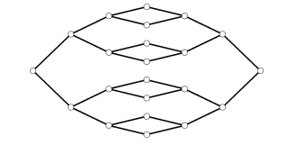
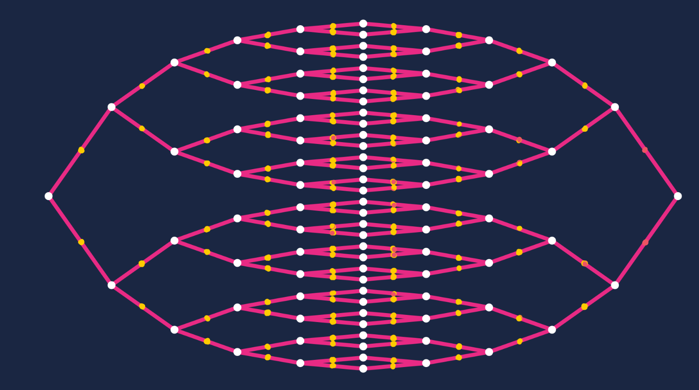

# Classical Graph Walk Simulator [WIP]
A classical glued-tree graph walker simulator. It explores graph like:

Demo available at: [https://georgep.co.uk/qcomp-project/graphSim/](https://georgep.co.uk/qcomp-project/graphSim/)

It is written in pure JavaScript (no build process, for once!)

Just made as an example for Physics Coursework. Should not be used in development. Spaghetti code is very prevalent!